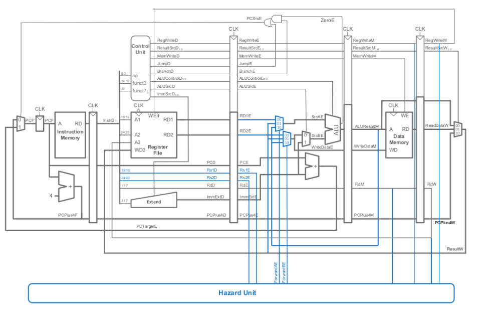
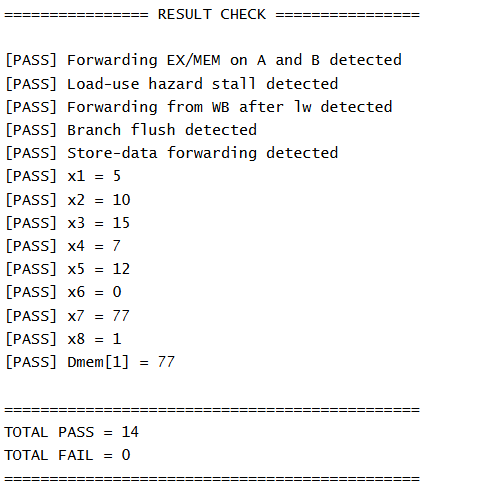

# RISC32I Pipelined Core

A 32-bit pipelined RISC-V CPU implemented in Verilog HDL. The design supports arithmetic, logical, immediate, load/store, and branch instructions, and is verified through simulation and FPGA testing.

## Features
- 5-stage pipelined CPU datapath
- Hazard detection and forwarding unit
- Load-use stall handling
- Branch flush control
- Store-data forwarding
- Verified by testbench simulation and FPGA testing

## Block Diagram
> Put your block diagram image in `docs/block_diagram.png`



## Program for test
addi x1,x0,5
add x2,x1,x1
add x3,x2,x1
lw x4,0(x0)
add x5,x4,x1
beq x1,x1,+8
flush
addi x7,x0,77
sw x7,4(x0)
ori x8,x0,1

## Testbench Result
> Put your simulation result image in `docs/tb_result.png`



## Verification Summary
The testbench confirms correct operation of:
- EX/MEM forwarding on source operands
- Load-use hazard stall
- Write-back forwarding after `lw`
- Branch flush
- Store-data forwarding

**Result:** 14/14 checks passed, 0 failed.

## Project Structure
```text
risc32I_pipelined/
├── src/ 
├── tb/               
├── docs/               
│   ├── block_diagram.png
│   └── tb_result.png
└── README.md
```

## Skills Demonstrated
- RTL design for pipelined RISC-V CPU
- Hazard detection and forwarding logic
- Functional verification and debugging
- Simulation, waveform analysis, and FPGA testing

## How to Use
1. Clone the repository
2. Open the project in your Verilog simulation / FPGA tool
3. Run the testbench to verify functionality
4. Synthesize and program on FPGA if needed

## Author
Minh Dang
